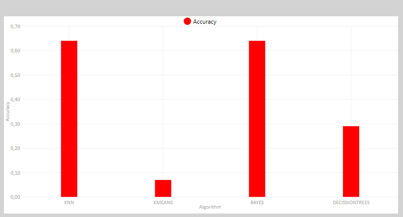
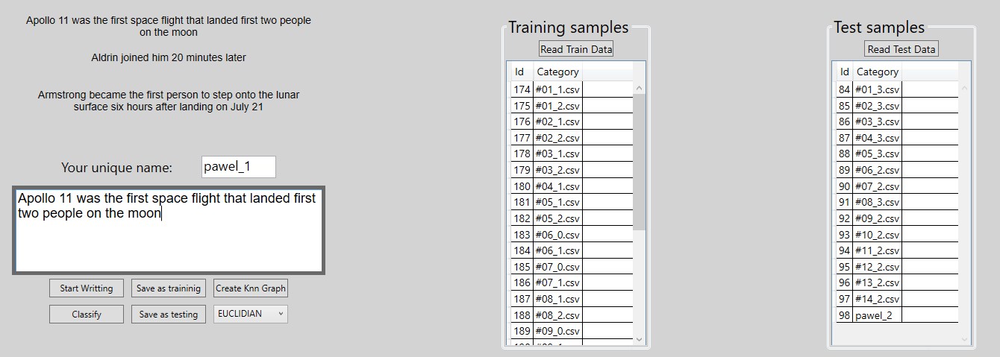
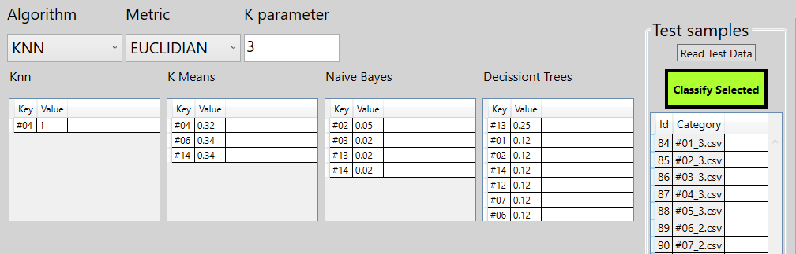
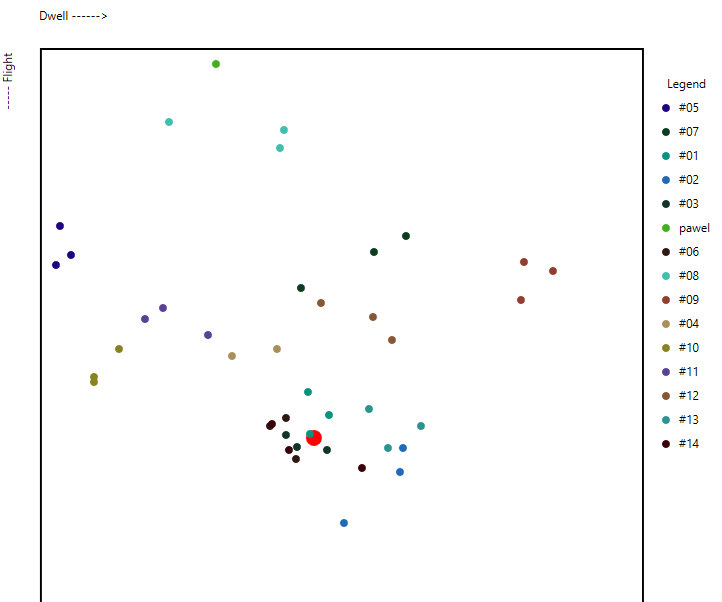
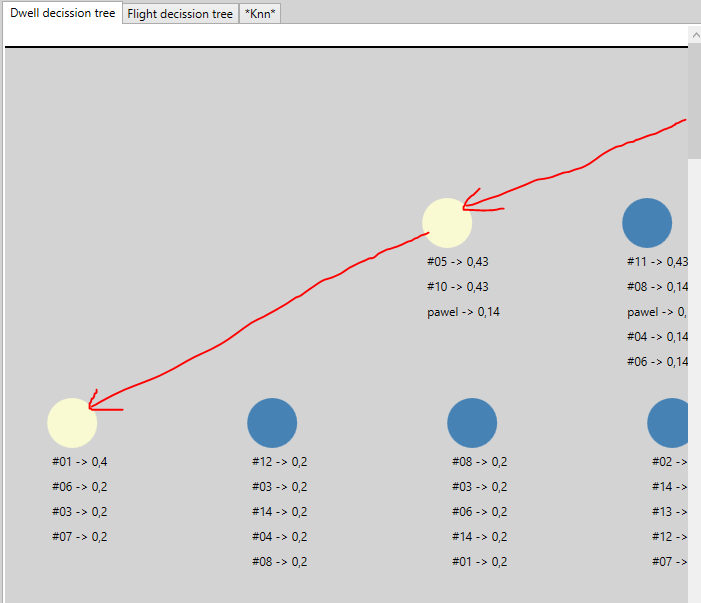

# Keystrokes Classification .net5.0 wpf

## Functionalities
* Classification of person, who is typing based on keystrokes dynamics, using algorithms as KNN, K-Means, Naive Bayes and Decission Trees approach.

* Comparing accuracy of each algorithm

## Technical notes
* Programm is able to gather data from user. While typing it measures time between clicked keys and time of every single click-hold

* That data and classification models were stored in local data base (Postgres), managed by Entity Framework

* Few commonly known distance Metrics were implemented (Euclidian, Manhatan, Chebyshev, and more), -  Accuracy varies depending on that

* As well, I tried to visualise as best as I can the model which algorithm uses:

